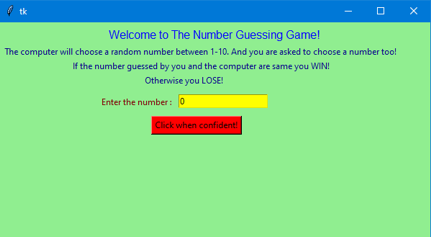
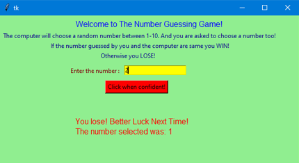

# Number-Guessing-game-using-Python-GUI
## Description of the Game
Guessing games are common, simple and interesting games which can be very effective for teenagers. In Number guessing game, the computer chooses an integer between 1 and 10 randomly. You will continue to guess numbers until you find the number of the computer, and each time the computer tells you the number it chose.

## Screenshots of the Game

#### Final Layout of the game

#### Wrong Guess Display

#### Winning Screen
